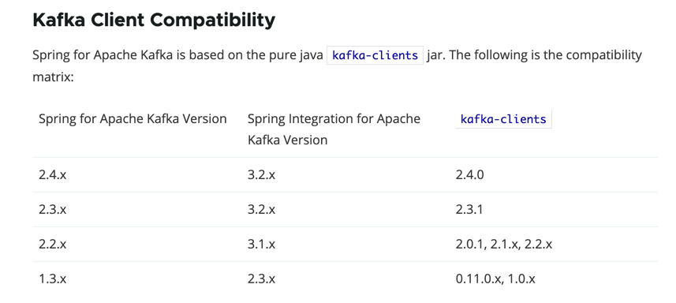

# Integration Tests with Embedded Kafka Server

Automated integration tests with Kafka are quite complex because of it's streaming and disconnected nature. One part fo the application keeps producing messages while the other part keeps consuming and for them to be tested end to end together is challenging.

The `spring-kafka-test` library provides an embedded Kafka broker and a Kafka Testing util that works great for this purpose.

To begin with add the below dependencies to your pom file:

```
    <dependency>
        <groupId>org.springframework.kafka</groupId>
        <artifactId>spring-kafka-test</artifactId>
        <version>${spring.kafka.version}</version>
        <scope>test</scope>
    </dependency>
    <dependency>
        <groupId>junit</groupId>
        <artifactId>junit</artifactId>
        <version>4.12</version>
        <scope>test</scope>
    </dependency>
    <dependency>
        <groupId>org.springframework.kafka</groupId>
        <artifactId>spring-kafka</artifactId>
        <version>${spring.kafka.version}</version>
    </dependency>
```



# How to use the Enbedded Kafka Server?

`spring-kafka-test` library provides a JUnit @Rule wrapper for the `EmbeddedKafkaBroker` to create an embedded Kafka and an embedded Zookeeper server.

The `EmbeddedKafkaRule` constructor function takes the following values as parameters.
- The number of Kafka servers to start.
- Whether a controlled shutdown is required.
- Issues that need to be created on the server.

```
@ClassRule
    public static EmbeddedKafkaRule kafka = new EmbeddedKafkaRule(1,
            false, KAFKA_TOPIC);
```

Now that the embedded server is fired up, one can start producing and consuming data.

**Example set up for a consumer:**

```
@BeforeClass
public static void setConsumer() {
    Map<String, Object> configs = new HashMap<>(KafkaTestUtils.consumerProps("consumer", "false",
            kafka.getEmbeddedKafka()));
    testConsumer = new DefaultKafkaConsumerFactory<>(configs, new LongDeserializer(), new StringDeserializer())
            .createConsumer();
    testConsumer.subscribe(singleton(KAFKA_TOPIC));
    testConsumer.poll(Duration.ofMillis(1000));

}
```

**Example set up for a producer:**

```
final Long timestamp = new Date().getTime();
Map<String, Object> configs = new HashMap<>(KafkaTestUtils.producerProps(kafka.getEmbeddedKafka()));
Producer<Long, String> producer = new DefaultKafkaProducerFactory<>(configs,
        new LongSerializer(), new StringSerializer()).createProducer();

// add data to topic
producer.send(new ProducerRecord<>(KAFKA_TOPIC, timestamp, "hello"));
producer.flush();
        
```

finally, in order to verify the data written to topic:

```
// Assert results
ConsumerRecord<Long, String> singleRecord = KafkaTestUtils
        .getSingleRecord(testConsumer, SECOND_TOPIC);

Assert.assertNotNull(singleRecord);
Assert.assertEquals(timestamp, singleRecord.key());
Assert.assertEquals("hello", singleRecord.value());
```

A more comprehensive example is present in the test code [here](https://github.com/vikasgautam18/kafka-beginning/blob/master/src/test/java/com/github/vikasgautam18/kafka/ProducerExampleTest.java) .